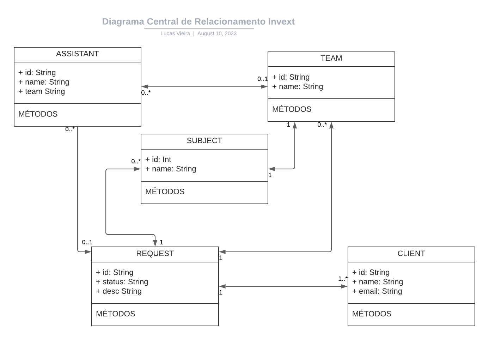

# **UBOTS Desafio Técnico  - Dev (Lucas Vieira)**
Desafio técnico, desenvolvimento de uma **API Rest** como solução para uma fintech de central de relacionamento

</br>

### Link da Documentação para uso da API: https://documenter.getpostman.com/view/10732905/2s9Xy3qqnX

</br>



</br>

# Introdução
A automatização da Central de Relacionamento foi proposta baseada em três regras crucias, que constam em detalhe na documentação da API, necessária para sua boa utilização: https://documenter.getpostman.com/view/10732905/2s9Xy3qqnX

- Atendes organizados em grupos que são designados para atender assuntos específicos
- Limite de até 3 solicitações em atendimento por atendente
- Lógica de atribuição de solicitações pendetes após a conclusão das solicitações vinculadas

</br>

**ATENÇÃO**

Para que você possa testar a API corretamente é necessário seguir os passos informados aqui e na documentação, ademais existem duas formas, uma através do client front-end construído com essa finalidade seu repositório pode ser encontrado aqui: https://github.com/lkasvr/ubots_front_end

E outra através de uma plataforma de gerenciamento de requisições HTTP como o **POSTMAN**.

## Organização do Código

O código da API foi desenvolvido em NODE **JS**, e sua organização foi estruturada em um padrão de arquitetura orientada a microserviços.

</br>

## Lógica de Gerenciamento da Fileira de Designação de Solicitações

- As solicitações criadas e que contenha os status **PENDENTE**, e não atribuídas a atendentes estão automaticamente sendo agendadas a cada 5 minumos para executarem o serviço de atualização da solicitação, e caso encontrado algum atendente que satisfaça a regra de negócio estipulada a solicitação será designada a ele.
- A lógica do enfileiramento de solicitação com status **PENDENTES** atende também alguns critérios para não sobrecarregar o banco de dados, sendo permitido que somente duas (2) solicitação sejam atribuídas por vez, mesmo que sua quantidade supere esse número (Nessa vertente o serviço de agendamento gera logs para um feedback das operações)
- Por uma questão de registro de histórico os atendentes possuem vinculados a eles as solicitações com status **CONCLUIDA** sem limite máximo, entretanto as que constam com o status **ADERIDA**  ou seja designadas a este atendente não passam de no máximo 3 solicitações.
- O restante dos detalhes sobre a API constam da sua documentação no POSTMAN

</br>

## Instruções de Execução do Projeto

### **AMBIENTE DE DESENVOLVIMENTO**

Primeiro, clone este reposiótio:

```bash
$ git clone git@github.com:lkasvr/ubots.git
```
Segundo, execute os comandos abaixo na raíz do projeto:

```bash
npm install
```

Após isso, e antes de executar o servidor, você deve fazer a migração e criação da **base de dados**; Para facilitar a API utiliza o **Prisma** como ORM que está configurado com o SQLite em um arquivo na prória estrutura do projeto, logo execute os seguintes comandos em sequência:

```bash
npx prisma migrate dev
```

```bash
npm run dev
```

</br>

Servidor estará executando por padrão no seguinte endereço e porta [http://localhost:3333](http://localhost:3333)

Caso a aplicação não entre em execução, pode ter havido um conflito de porta com algum processo do seu sistema já em execução, nesse caso altere apenas a porta no arquvi **server.ts** e execute o comando acima novamente.

</br>


